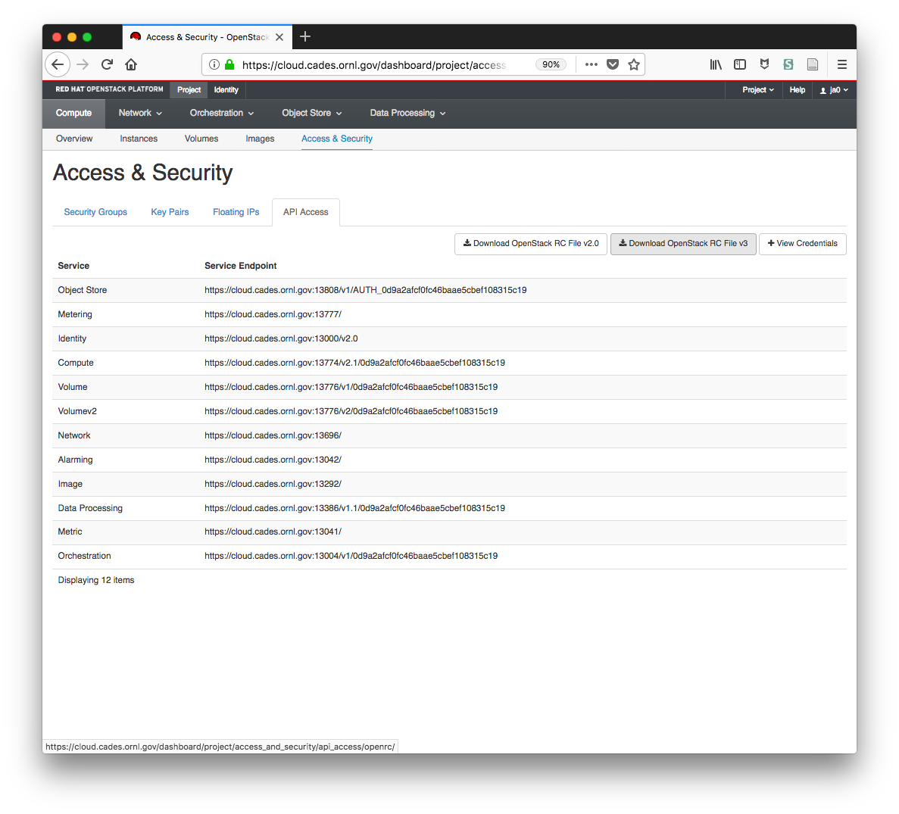

# openstack

The OpenStack modules in Ansible provide a mechanism for creating, managing,
and destroying OpenStack VMs.

## Authentication

The easiest way to provide your OpenStack authentication is to download the 
OpenStack RC File v3 from the Horizon web interface as shown in the figure.
Copy this file to a directory on your ansible controller machine that is not
under version control it, and source it any session you want to use the 
OpenStack API.

## Configs

Your `vault/main.yml` file should contain the four variables referenced
in the companion file `vars/main.yml`. The `openstack_project_name` is typically
`BR_<openstack_username>`.

